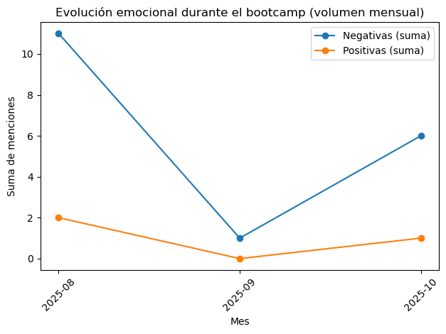

# Text Analytics aplicado a aprendizaje intensivo  
**Ela Ruiz González**

## Overview

Este proyecto nace de la curiosidad por comprobar si un diario no estructurado puede transformarse en un dataset analizable. A través de técnicas de limpieza, 
extracción de keywords y feature engineering,
el texto se convierte en métricas cuantificables que permiten evaluar patrones emocionales y carga formativa.

El enfoque es metodológico: demostrar cómo narrativa cualitativa puede convertirse en indicadores medibles aplicables en negocio, especialmente en análisis de feedback, 
experiencia de usuario y programas formativos.

## Objetivo

Evaluar si la intensidad asociada a estudio y exámenes muestra relación con patrones emocionales medibles derivados del texto.

## Dataset

- 16 registros diarios  
- 14 variables estructuradas  
- 0 duplicados  
- Tipado consistente (`datetime64`, `int64`)  
- Nulos residuales controlados  

### Variables clave

- Conteo de palabras  
- Keywords emocionales (`ansiedad`, `frustración`, `miedo`, `cansancio`, `confianza`, `felicidad`)  
- Keywords de actividad (`estudio`, `examen`)  
- Totales positivos y negativos  
- Índice emocional neto  
- Ratios normalizados por longitud de texto  

## Metodología

- Limpieza y normalización del texto  
- Extracción manual de keywords emocionales  
- Feature engineering (totales, ratios, índice neto)  
- Agregación temporal diaria y mensual  
- Análisis exploratorio y evaluación visual  

Enfoque estrictamente exploratorio debido al tamaño muestral reducido.

## Hallazgos

- Predominio de emociones asociadas a carga cognitiva (ansiedad, cansancio, frustración).  
- Emociones positivas presentes de forma puntual.  
- No se observa correlación lineal fuerte entre intensidad diaria y estado emocional neto.  
- La agregación mensual sugiere fases diferenciadas dentro del proceso formativo.

## Limitaciones

- Tamaño muestral reducido (N = 16).  
- Diccionario emocional basado en matching literal.  
- No se aplicaron técnicas avanzadas de NLP ni modelos inferenciales.

## Valor profesional

- Pipeline completo: texto → features → métricas → visualización.  
- Diseño de indicadores normalizados.  
- Análisis crítico de correlación vs causalidad.  
- Aplicación práctica de text analytics sobre datos reales.

## Aplicabilidad a negocio

Este framework puede trasladarse directamente a entornos profesionales:

- Análisis de feedback cualitativo de clientes o empleados.  
- Detección temprana de sobrecarga o riesgo de abandono en programas formativos.  
- Monitorización emocional en procesos de onboarding o transformación digital.  
- Análisis de experiencia de usuario a partir de comentarios abiertos.  
- Evaluación del impacto emocional de productos o servicios digitales.  

Permite convertir narrativa cualitativa en indicadores medibles que apoyan la toma de decisiones.

---

**Ela Ruiz González**  
Data Analyst  
Python · Pandas · Matplotlib · Text Analytics · Data Cleaning · EDA
